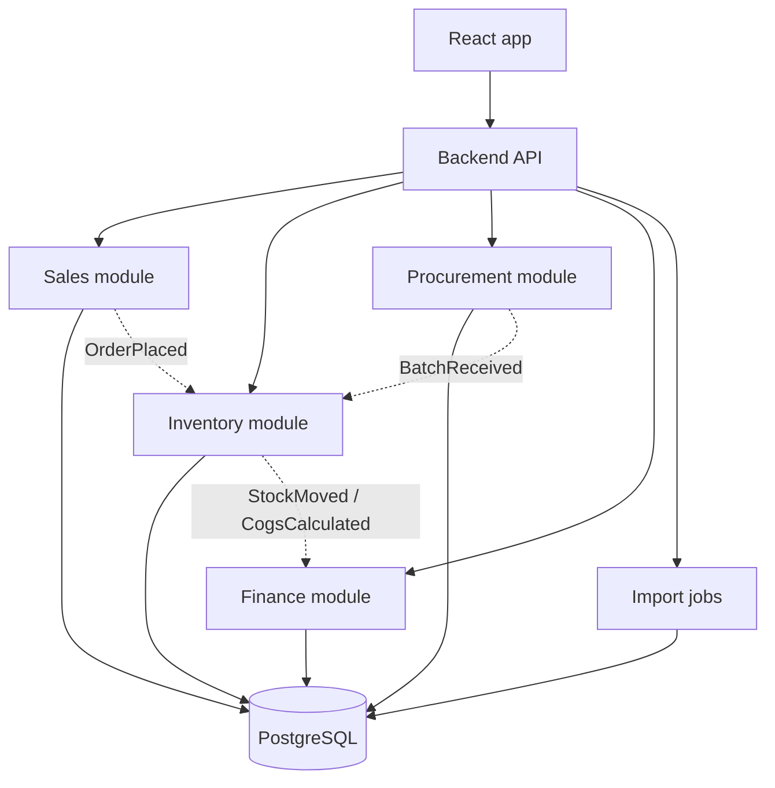

# Kien truc muc tieu cho phan mem quan ly ban hang

Ngay: 2026-07-08  
Trang thai: de xuat  
Nguon: tong hop review Codex + agy `Gemini 3.1 Pro (High)`

## Quyet dinh chinh

Chon **modular monolith** thay vi microservices cho giai do hien tai. Ly do: team nho, nghiep vu can chinh xac hon la scale phan tan, va he thong can giao dich ACID cho ton kho/FIFO/doi soat.

Stack muc tieu de trien khai thuc te:

- Frontend: React/Vite tiep tuc dung, bo sung React Query hoac SWR khi co API.
- Backend: Node.js/NestJS, Laravel, hoac FastAPI deu phu hop; uu tien framework team de van hanh.
- Database: PostgreSQL.
- File/import: xu ly Excel qua job co validation truoc khi ghi vao database.
- Auth: tai khoan noi bo, role `owner`, `operator`, `accountant`.

## So do tong the



## Module boundaries

`Sales`

- Quan ly don hang, kenh ban, trang thai giao/hoan, doanh thu du kien.
- Khong tu tinh gia von; chi yeu cau Inventory xuat kho.

`Inventory`

- Quan ly SKU, ton kho, batch, stock transaction.
- La noi duy nhat duoc thuc thi FIFO.

`Procurement`

- Quan ly phieu nhap, chi phi mua hang, ship noi dia, ship quoc te, giam gia, boi thuong.
- Khi phieu nhap duoc xac nhan, tao batch voi `unit_cost` da phan bo.

`Finance`

- Quan ly doi soat doanh thu, COGS, loi nhuan gop, ledger.
- Nhan ket qua tu Inventory thay vi tinh lai FIFO rieng.

## Schema cap cao

```text
products(id, sku, name, status, created_at)
purchase_orders(id, code, supplier, received_at, notes)
purchase_items(id, purchase_order_id, product_id, qty, total_cost, total_weight)
inventory_batches(id, product_id, purchase_item_id, received_at, qty_initial, qty_remaining, unit_cost)
stock_transactions(id, product_id, batch_id, type, qty, unit_cost, reference_type, reference_id, created_at)
orders(id, channel, external_code, status, ordered_at, expected_revenue, actual_revenue)
order_items(id, order_id, product_id, qty, selling_price, return_status)
losses(id, product_id, qty, reason, occurred_at)
reconciliations(id, channel, period, source_file, status, expected_amount, actual_amount)
ledger_entries(id, account, direction, amount, reference_type, reference_id, created_at)
audit_logs(id, actor_id, action, entity_type, entity_id, before_json, after_json, created_at)
```

## FIFO trong backend

Luot xuat kho phai chay trong transaction:

1. Lay cac batch con ton theo `received_at ASC`.
2. Lock batch can tru bang row-level lock.
3. Tru so luong theo tung batch.
4. Ghi `stock_transactions` append-only.
5. Tra ve COGS cho Sales/Finance.

Khong nen cho phep am kho im lang. Neu can ban truoc khi hang ve, tao trang thai `backorder` rieng.

## Lo trinh 30/60/90 ngay

30 ngay:

- Tach logic FIFO/phan bo chi phi thanh pure functions co unit test.
- Chuan hoa mapping Excel va thong bao loi SKU.
- Sua Dashboard dung du lieu that tu store thay vi demo.

60 ngay:

- Dung backend modular monolith + PostgreSQL.
- Tao API cho product, purchase, order, loss.
- Migration du lieu local hien co sang database bang import co kiem tra.

90 ngay:

- Them audit trail, reconciliation workflow, role nguoi dung.
- Them test transaction FIFO/concurrency.
- Chuan bi backup, export, va bao cao loi nhuan theo shop/thang.

## Tieu chi nghiem thu kien truc

- Mot don hang co the truy ve duoc da tru nhung batch nao, gia von bao nhieu.
- Mot phieu hao hut tao duoc stock transaction va ledger entry tuong ung.
- Doi soat doanh thu giu duoc file nguon/import log va sai lech theo don.
- Build frontend dat; backend co test cho FIFO, oversell, return, loss.

