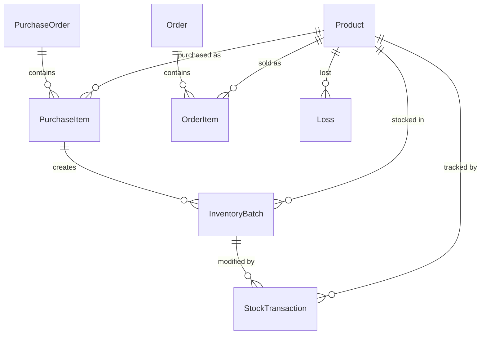

# Báo cáo Kiến trúc Hệ thống — Quản lý Tồn kho BAP

> ⚠️ **Tài liệu lịch sử (2026-07-09).** Mô tả hiện trạng *trước* khi triển khai lộ trình 10 đợt. Backend, phân quyền, activity log, UI redesign đã hoàn tất (xem `docs/Memory.md`). Giữ làm bản ghi audit.

> **Ngày**: 2026-07-09  
> **Phạm vi**: Toàn bộ hệ thống (Frontend, Backend, Database, Hosting, CI/CD)  
> **Trạng thái tổng quan**: MVP hoạt động ở frontend, backend chưa kết nối

---

## Mục lục

1. [Tổng quan kiến trúc](#1-tổng-quan-kiến-trúc)
2. [Frontend](#2-frontend)
3. [Backend API](#3-backend-api)
4. [Database](#4-database)
5. [Authentication](#5-authentication)
6. [Hosting & Deployment](#6-hosting--deployment)
7. [CI/CD Pipeline](#7-cicd-pipeline)
8. [Vấn đề nghiêm trọng](#8-vấn-đề-nghiêm-trọng)
9. [Đề xuất cải thiện](#9-đề-xuất-cải-thiện)
10. [Tổng hợp trạng thái](#10-tổng-hợp-trạng-thái)

---

## 1. Tổng quan kiến trúc

```
┌─────────────────────────────────────────────────────────┐
│                     NGƯỜI DÙNG                          │
│                    (Trình duyệt)                        │
└────────────────────────┬────────────────────────────────┘
                         │
                         ▼
┌─────────────────────────────────────────────────────────┐
│              FIREBASE HOSTING (SPA)                     │
│          tanle-dev-lynstore.web.app                     │
│                                                         │
│  React 19 + Vite 8 + react-router-dom 7                │
│  ┌──────────┐  ┌──────────┐  ┌────────────────────┐    │
│  │ Firebase  │  │ Store    │  │ Domain Logic       │    │
│  │ Auth      │  │ Context  │  │ (FIFO, Profit,     │    │
│  │ (login)   │  │ + local  │  │  Pricing)          │    │
│  │           │  │ Storage  │  │                    │    │
│  └──────────┘  └──────────┘  └────────────────────┘    │
│                                                         │
│  ⚠️ api.js TỒN TẠI nhưng CHƯA ĐƯỢC SỬ DỤNG           │
└─────────────────────────┬───────────────────────────────┘
                          │ (chưa kết nối)
                          ▼
┌─────────────────────────────────────────────────────────┐
│           CLOUD RUN (chưa deploy)                       │
│           bap-backend-api · asia-southeast1             │
│                                                         │
│  Express 5 + TypeScript + Prisma ORM                    │
│  ┌──────────┐  ┌──────────┐  ┌──────────────────┐      │
│  │ Auth     │  │ Services │  │ Routes            │      │
│  │ Middle-  │  │ Procure- │  │ GET  /health      │      │
│  │ ware     │  │ ment     │  │ GET  /api/products│      │
│  │ (Firebase│  │ Inventory│  │ POST /api/products│      │
│  │  Admin)  │  │ Finance  │  │ POST /api/purchases│     │
│  └──────────┘  └──────────┘  │ POST /api/orders  │      │
│                               └──────────────────┘      │
└─────────────────────────┬───────────────────────────────┘
                          │
                          ▼
┌─────────────────────────────────────────────────────────┐
│              POSTGRESQL (Prisma Postgres)                │
│              localhost:51213 (dev local)                 │
│                                                         │
│  9 models: Product, PurchaseOrder, PurchaseItem,        │
│  InventoryBatch, StockTransaction, Order, OrderItem,    │
│  Loss, LedgerEntry + Reconciliation                     │
└─────────────────────────────────────────────────────────┘
```

**Kiến trúc hiện tại**: Monolith SPA + API riêng biệt (chưa kết nối). Frontend tự chứa toàn bộ dữ liệu trong `localStorage`.

---

## 2. Frontend

### 2.1 Công nghệ

| Thành phần | Chi tiết |
|------------|----------|
| **Framework** | React 19.2.7 |
| **Build** | Vite 8.1.1 + `@vitejs/plugin-react` 6.0.3 |
| **Ngôn ngữ** | JavaScript (JSX) — không TypeScript |
| **Linter** | oxlint 1.71.0 (Rust, nhanh) |
| **Router** | react-router-dom 7.18.1 (BrowserRouter) |
| **CSS** | Vanilla CSS đơn file (`index.css`, 612 dòng) + inline styles |
| **Font** | Inter (Google Fonts CDN) |
| **Icons** | lucide-react 1.23.0 |
| **Charts** | recharts 3.9.2 (BarChart) |
| **Excel** | xlsx 0.18.5 (import đơn hàng) |

### 2.2 Cấu trúc thư mục

```
src/
├── main.jsx                    — Entry: AuthProvider > StoreProvider > App
├── App.jsx                     — Router + Sidebar + auth guard
├── index.css                   — Design system (CSS variables, responsive)
├── assets/                     — hero.png, react.svg, vite.svg
├── components/
│   └── ProductImage.jsx        — Async image loader từ IndexedDB
├── domain/                     — Business logic thuần (không React)
│   ├── inventory.js            — FIFO engine, giá gợi ý, buildDerivedStore()
│   ├── profitAnalytics.js      — Lợi nhuận theo tháng/shop, chia sẻ partner
│   ├── imageDb.js              — IndexedDB wrapper cho ảnh sản phẩm
│   └── imageProcessor.js       — Resize + nén WebP client-side
├── lib/                        — Hạ tầng
│   ├── firebase.js             — Firebase init (Auth only)
│   ├── AuthContext.jsx          — Firebase Auth Context
│   ├── api.js                  — REST client (⚠️ CHƯA SỬ DỤNG)
│   └── useLocalStorage.js      — Hook sync state ↔ localStorage
├── pages/                      — 9 trang
│   ├── Login.jsx               — Đăng nhập/đăng ký
│   ├── Dashboard.jsx           — KPI + biểu đồ doanh thu
│   ├── Purchases.jsx           — Nhập hàng + phân bổ chi phí
│   ├── Products.jsx            — Tồn kho + batch FIFO
│   ├── Orders.jsx              — Xuất bán + import Excel
│   ├── Losses.jsx              — Hao hụt
│   ├── Profit.jsx              — Lợi nhuận theo shop/tháng
│   ├── Treasury.jsx            — Sổ quỹ
│   └── Settings.jsx            — Cài đặt
└── store/
    ├── StoreContext.jsx        — Provider + CRUD + derived FIFO state
    └── appStoreContext.js      — createContext + useAppStore hook
```

**Tổng**: ~27 file, ~3,034 dòng JS/JSX.

### 2.3 Quản lý State

```
┌─ AuthContext (Firebase Auth) ─────────────────────┐
│  user, login(), register(), logout(), getToken()  │
│                                                    │
│  ┌─ StoreContext (localStorage) ──────────────┐   │
│  │  products, purchases, orders, losses,       │   │
│  │  monthlyAds, transactions, accounts,        │   │
│  │  partners, packagingCost, returnFee         │   │
│  │                                              │   │
│  │  CRUD: addPurchase, addOrder, addLoss, ...  │   │
│  │  Derived: buildDerivedStore() via useMemo   │   │
│  └──────────────────────────────────────────────┘   │
└─────────────────────────────────────────────────────┘
```

- **Mọi dữ liệu nghiệp vụ** nằm trong `localStorage` (prefix `bap-store.`)
- **FIFO** được tính lại mỗi lần render qua `useMemo`
- **Ảnh sản phẩm** lưu trong IndexedDB (nén WebP client-side)
- Không dùng Redux, Zustand, hay Firestore

### 2.4 Routes

| Path | Component | Chức năng |
|------|-----------|-----------|
| `/` | Dashboard | Tổng quan KPI + biểu đồ |
| `/purchases` | Purchases | Nhập hàng quốc tế |
| `/products` | Products | Tồn kho FIFO |
| `/orders` | Orders | Xuất bán đa kênh |
| `/losses` | Losses | Hao hụt |
| `/profit` | Profit | Phân tích lợi nhuận |
| `/treasury` | Treasury | Sổ quỹ |
| `/settings` | Settings | Cài đặt hệ thống |

### 2.5 Dependencies (7 production)

| Package | Dùng cho |
|---------|----------|
| `firebase` ^12.15.0 | Auth (chỉ auth, không Firestore/Storage) |
| `lucide-react` ^1.23.0 | Icons toàn app |
| `recharts` ^3.9.2 | Biểu đồ Dashboard + Profit |
| `xlsx` ^0.18.5 | Import Excel đơn hàng |
| `react` + `react-dom` | Core |
| `react-router-dom` | Routing |

---

## 3. Backend API

### 3.1 Công nghệ

| Thành phần | Chi tiết |
|------------|----------|
| **Runtime** | Node.js 20 (Alpine Docker) |
| **Framework** | Express 5.2.1 |
| **Ngôn ngữ** | TypeScript 7.0.2 (strict mode) |
| **ORM** | Prisma 7.8.0 |
| **Database** | PostgreSQL (Prisma Postgres) |
| **Auth** | firebase-admin 14.1.0 |
| **Module** | CommonJS |
| **Dev tools** | nodemon, ts-node |

### 3.2 Cấu trúc

```
backend/
├── Dockerfile              — Multi-stage build (node:20-alpine)
├── prisma/
│   └── schema.prisma       — 9 models + LedgerEntry
├── src/
│   ├── index.ts            — Express app + routes (inline)
│   ├── prismaClient.ts     — Singleton PrismaClient
│   ├── middlewares/
│   │   └── authMiddleware.ts — Firebase Admin verifyIdToken
│   └── services/
│       ├── procurementService.ts — Tạo PO + phân bổ chi phí + batch
│       ├── inventoryService.ts   — FIFO deduction (SELECT FOR UPDATE)
│       └── financeService.ts     — Ghi hao hụt + ledger
```

**Tổng**: 10 file source, backend nhỏ giai đoạn đầu.

### 3.3 API Endpoints

| Method | Path | Auth | Mô tả |
|--------|------|------|-------|
| `GET` | `/health` | ❌ | Health check |
| `GET` | `/api/products` | ✅ | Danh sách sản phẩm |
| `POST` | `/api/products` | ✅ | Tạo sản phẩm (⚠️ không validate) |
| `POST` | `/api/purchases` | ✅ | Tạo phiếu nhập + phân bổ chi phí |
| `POST` | `/api/orders` | ✅ | Tạo đơn bán + FIFO deduction + COGS |

### 3.4 Service Logic

**procurementService** — Phân bổ chi phí nhập hàng:
- `costRatio` (theo giá trị) → phân bổ: discount, compensation, purchasing fee
- `weightRatio` (theo trọng lượng) → phân bổ: domestic + international shipping
- `unitCost = finalTotalCost / qty`
- Atomic: `$transaction` tạo PO → PurchaseItem → InventoryBatch → StockTransaction

**inventoryService** — FIFO deduction:
- Raw SQL `SELECT FOR UPDATE` lock row-level, order by `receivedAt ASC`
- Trừ lần lượt từ batch cũ nhất
- Tạo StockTransaction (type "OUT", qty âm)
- Throw nếu không đủ tồn kho

**financeService** — Ghi hao hụt:
- Tạo Loss → gọi FIFO deduction → tạo LedgerEntry
- ⚠️ **BUG**: 2 transaction riêng biệt (không atomic)

---

## 4. Database

### 4.1 Schema (PostgreSQL + Prisma)



### 4.2 Models (9 + LedgerEntry)

| Model | Mô tả | PK |
|-------|--------|----|
| **Product** | Sản phẩm (sku unique, name, status) | UUID |
| **PurchaseOrder** | Phiếu nhập hàng (code unique, supplier, notes) | UUID |
| **PurchaseItem** | Dòng chi tiết nhập (qty, totalCost, totalWeight) | UUID |
| **InventoryBatch** | Lô hàng FIFO (qtyInitial, qtyRemaining, unitCost) | UUID |
| **StockTransaction** | Lịch sử kho (IN/OUT/LOSS/RETURN) | UUID |
| **Order** | Đơn bán (channel, externalCode, status, revenue) | UUID |
| **OrderItem** | Chi tiết đơn bán (qty, sellingPrice, returnStatus) | UUID |
| **Loss** | Hao hụt (qty, reason, occurredAt) | UUID |
| **Reconciliation** | Đối soát doanh thu (channel, period, expected vs actual) | UUID |
| **LedgerEntry** | Sổ cái (account, DEBIT/CREDIT, amount, reference) | UUID |

### 4.3 Vấn đề Schema

| Vấn đề | Mức độ | Chi tiết |
|--------|--------|----------|
| Float cho tiền | 🔴 Cao | `totalCost`, `unitCost`, `amount` dùng `Float` thay vì `Decimal` → sai số tích lũy |
| Không có Enum | 🟡 Trung bình | `type`, `status`, `direction`, `channel` là `String` → không có constraint DB |
| Không có migration | 🟡 Trung bình | Thư mục `prisma/migrations` không tồn tại |
| Reconciliation cô lập | 🟢 Thấp | Không có relation với Order hay channel nào |

---

## 5. Authentication

### 5.1 Luồng xác thực

```
Browser                  Firebase Auth              Cloud Run API
  │                           │                          │
  ├── signInWithEmail() ──────►                          │
  │                           │                          │
  ◄── JWT ID Token ───────────┤                          │
  │                           │                          │
  ├── GET /api/products ──────┼──── Bearer <token> ──────►
  │                           │                          │
  │                           │    verifyIdToken(token)  │
  │                           ◄──────────────────────────┤
  │                           │                          │
  │                           ├── decoded user ──────────►
  │                           │                          │
  ◄── 200 OK + data ─────────┼──────────────────────────┤
```

### 5.2 Chi tiết

| Phía | Thư viện | Chức năng |
|------|----------|-----------|
| **Frontend** | `firebase` ^12.15.0 | `signInWithEmailAndPassword`, `onAuthStateChanged` |
| **Backend** | `firebase-admin` ^14.1.0 | `admin.auth().verifyIdToken()` |
| **Provider** | Firebase Auth (Email/Password) | Project: `tanle-dev` |

- Frontend guard: `if (!user) return <Login />`  (không có route-level guard)
- Backend middleware: Kiểm tra `Authorization: Bearer <token>` header
- ⚠️ Không có role-based access, mọi user authenticated đều có full access

---

## 6. Hosting & Deployment

### 6.1 Frontend — Firebase Hosting

| Config | Giá trị |
|--------|---------|
| **GCP Project** | `tanle-dev` |
| **Hosting site** | `tanle-dev-lynstore` |
| **URL** | https://tanle-dev-lynstore.web.app |
| **Public dir** | `dist/` (Vite build output) |
| **SPA rewrite** | Tất cả routes → `/index.html` |
| **Trạng thái** | ✅ Đã deploy, đang hoạt động |

### 6.2 Backend — Google Cloud Run

| Config | Giá trị |
|--------|---------|
| **Service** | `bap-backend-api` |
| **Region** | `asia-southeast1` |
| **Image** | `asia-southeast1-docker.pkg.dev/tanle-dev/bap-repo/bap-backend-api` |
| **Trạng thái** | ❌ **Chưa bao giờ deploy** |

**Chưa hoàn thành**:
- Artifact Registry repo `bap-repo` chưa tạo
- GitHub Secrets chưa cấu hình
- Database production chưa có

### 6.3 Dockerfile

```dockerfile
FROM node:20-alpine AS builder
# npm ci → prisma generate → tsc build

FROM node:20-alpine
# Copy node_modules, dist, prisma
EXPOSE 3000
CMD ["npm", "start"]
```

⚠️ **Vấn đề**: Copy toàn bộ `node_modules` (bao gồm devDependencies) vào production image.

---

## 7. CI/CD Pipeline

### 7.1 GitHub Actions (`.github/workflows/deploy.yml`)

```
Push to main
    │
    ├── deploy-frontend (nếu thay đổi src/, index.html, package.json, vite.config.js)
    │     npm ci → npm run build → Firebase Hosting deploy
    │
    └── deploy-backend (nếu thay đổi backend/ hoặc deploy.yml)
          Auth (Workload Identity Federation) → Docker build → 
          Push Artifact Registry → Deploy Cloud Run
```

### 7.2 GitHub Secrets cần thiết

| Secret | Mô tả | Trạng thái |
|--------|--------|-----------|
| `FIREBASE_SERVICE_ACCOUNT_TANLE_DEV` | Firebase deploy key | ❌ Chưa set |
| `WIF_PROVIDER` | Workload Identity Federation provider | ❌ Chưa set |
| `WIF_SERVICE_ACCOUNT` | GCP service account | ❌ Chưa set |
| `DATABASE_URL` | PostgreSQL connection string | ❌ Chưa set |

**⚠️ CI/CD pipeline định nghĩa đầy đủ nhưng không thể chạy vì chưa cấu hình secrets.**

---

## 8. Vấn đề nghiêm trọng

### 🔴 Nghiêm trọng (Cần sửa ngay)

| # | Vấn đề | Vị trí | Tác động |
|---|--------|--------|----------|
| 1 | **Dữ liệu chỉ ở localStorage** | Frontend toàn bộ | Mất toàn bộ dữ liệu nếu xóa cache trình duyệt. Không sync đa thiết bị. |
| 2 | **Backend chưa kết nối** | `api.js` không import ở đâu | Frontend và Backend là 2 hệ thống hoàn toàn tách rời |
| 3 | **Float cho tiền** | `schema.prisma` | Sai số tích lũy khi tính COGS, lợi nhuận — dùng `Decimal` thay thế |
| 4 | **Bug transaction financeService** | `financeService.ts` | Loss + FIFO deduction chạy 2 transaction riêng → không atomic |
| 5 | **Không validate input** | `POST /api/products` | Pass thẳng `req.body` vào Prisma, nguy cơ injection/data corruption |

### 🟡 Trung bình (Nên sửa)

| # | Vấn đề | Vị trí | Tác động |
|---|--------|--------|----------|
| 6 | CORS mở toàn bộ | `src/index.ts` | Cho phép mọi origin gọi API |
| 7 | Không có enum DB | `schema.prisma` | String type/status không có constraint |
| 8 | Dead code — `recordLoss()` | `financeService.ts` | Function tồn tại nhưng không route nào gọi |
| 9 | Thiếu CRUD endpoints | Backend routes | 5 endpoint cho 9 model, không có PUT/DELETE |
| 10 | Docker copy devDependencies | `Dockerfile` | Image production lớn hơn cần thiết |
| 11 | Stale build artifacts | `dist/assets/` | 9 JS bundles cũ tích lũy, chỉ 1 đang dùng |
| 12 | Không có error handling middleware | Express routes | Async errors không được catch → crash |
| 13 | CI/CD secrets chưa set | GitHub | Pipeline không thể chạy |

### 🟢 Thấp (Cải thiện sau)

| # | Vấn đề | Vị trí |
|---|--------|--------|
| 14 | Sidebar inline trong App.jsx | Frontend |
| 15 | Không có TypeScript ở frontend | Toàn bộ `src/` |
| 16 | Firebase Analytics configured nhưng không dùng | `firebase.js` |
| 17 | Không có role-based access | Auth flow |

---

## 9. Đề xuất cải thiện

### Giai đoạn 1: Ổn định dữ liệu (Ưu tiên cao nhất)

1. **Kết nối Frontend → Backend API**: Import `api.js` vào các page, thay localStorage bằng API calls
2. **Deploy Backend lên Cloud Run**: Tạo Artifact Registry, set GitHub Secrets, deploy
3. **Database production**: Setup PostgreSQL instance (Cloud SQL hoặc Supabase)
4. **Sửa Float → Decimal**: Migration schema cho tất cả trường tiền

### Giai đoạn 2: Chất lượng code

5. **Input validation**: Thêm Zod schema cho tất cả API endpoints
6. **Sửa financeService transaction bug**: Merge vào single `$transaction`
7. **Error handling middleware**: Thêm global async error handler cho Express 5
8. **CORS restriction**: Chỉ cho phép domain frontend
9. **Bổ sung CRUD endpoints**: GET/PUT/DELETE cho orders, purchases, losses, reconciliation
10. **Tối ưu Dockerfile**: `npm ci --omit=dev` ở production stage

### Giai đoạn 3: Mở rộng

11. **Firestore cho real-time sync** hoặc giữ PostgreSQL + WebSocket
12. **Role-based access**: Phân quyền owner/staff
13. **Reconciliation workflow**: Endpoints + UI cho đối soát doanh thu
14. **Backup strategy**: Automated DB backups

---

## 10. Tổng hợp trạng thái

| Thành phần | Trạng thái | Ghi chú |
|------------|-----------|---------|
| Frontend (React SPA) | ✅ Hoạt động | 8 trang, đầy đủ chức năng cơ bản |
| Firebase Auth | ✅ Hoạt động | Email/Password, Login page có |
| Firebase Hosting | ✅ Deployed | https://tanle-dev-lynstore.web.app |
| Backend (Express API) | ⚠️ Code có, chưa deploy | 5 endpoints, 3 services |
| Database (PostgreSQL) | ⚠️ Local only | 9 models, schema xong, chưa migrate |
| Cloud Run | ❌ Chưa deploy | Dockerfile có, Artifact Registry chưa tạo |
| CI/CD (GitHub Actions) | ❌ Chưa hoạt động | Workflow có, secrets chưa set |
| Frontend ↔ Backend | ❌ Chưa kết nối | `api.js` viết rồi nhưng không import |
| Dữ liệu thực | ⚠️ localStorage | Mất khi xóa cache, không sync đa thiết bị |

---

> **Kết luận**: Hệ thống ở trạng thái MVP frontend-only. Backend skeleton đã xây dựng tốt với FIFO logic đúng nghiệp vụ, nhưng chưa được deploy và chưa kết nối với frontend. Ưu tiên số 1 là kết nối frontend → backend API và chạy local PostgreSQL để dữ liệu nghiệp vụ được lưu trữ an toàn, sau đó deploy lên Google Cloud khi ổn định.

> **👉 Bước tiếp theo**: Xem [Kế hoạch Migration: localStorage → Local PostgreSQL → Google Cloud](./2026-07-09-migration-plan-local-to-cloud.md) để thực hiện từng bước.
